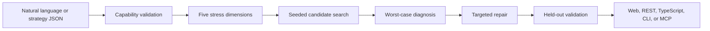

# Strategy Doctor

Strategy Doctor is an AI trading-infra copilot for the Bitget AI Hackathon. It stress-tests a registered strategy across five market-risk dimensions, explains the failure modes, proposes constrained parameter repairs, and verifies the trade-off on independent held-out scenarios.

It is not another strategy generator. It is the safety and evidence layer between "an agent produced a strategy" and "a team is confident enough to evaluate deployment."

## Why It Matters

Trading agents can create ideas quickly, but teams still need rigorous answers:

- Which market regime breaks this strategy?
- Why did it fail?
- Which parameters should change?
- Did the repair improve robustness, and what return cost did it create?
- Can another agent call the system safely through a stable API?

Strategy Doctor turns those questions into deterministic evidence.

## Core Capabilities

- Five-dimension diagnosis: `sentiment`, `macro`, `market-intel`, `news`, and `technical`.
- Two registered strategies: `ma-cross` and `rsi-bollinger-mean-reversion`.
- Natural-language strategy drafting with explicit human confirmation.
- Shared generic backtest engine with strategy adapters.
- Targeted prescriptions instead of arbitrary strategy rewrites.
- Independent held-out validation with explicit robustness and return trade-off.
- Protected Web workspace, REST API, OpenAPI, TypeScript client, CLI, and MCP adapter.
- Offline deterministic default mode; live Bitget public market data is opt-in and does not require private trading credentials.
- Reviewer-ready submission evidence pack.



## Quick Start

Node.js 24 or newer is required.

```powershell
npm.cmd ci
npm.cmd run verify
```

If `npm.cmd` is not available in your `PATH`, use the bundled Node runtime directly:

```powershell
& 'D:\tools\node-v24.14.0-win-x64\node.exe' --test "tests/**/*.test.ts"
```

## Run The Local Showcase

The recommended Windows entrypoint avoids PATH issues, clears a stale port, builds the Web client, starts the server, and prints the access code.

```powershell
.\scripts\start-showcase.ps1
```

If PowerShell script execution is disabled on your machine, use:

```powershell
.\scripts\start-showcase.cmd
```

Open:

```text
http://127.0.0.1:8080/showcase
```

Default local access code:

```text
team-preview-code-change-me
```

Stop the local server:

```powershell
.\scripts\stop-showcase.ps1
```

## Long-Lived Public URL

For a durable public link, do **not** use the temporary Cloudflare tunnel.

- Deploy with `render.yaml` (recommended) using `Dockerfile`.
- Bind host to `0.0.0.0` and set `DOCTOR_WEB_ACCESS_CODE` +
  `DOCTOR_SESSION_SECRET` in production environment variables.
- Keep `/judge` public, and keep `/showcase` protected by the access code.

See:

- [Public deployment playbook](docs/DEPLOY_PUBLIC.md)
- [Public demo and quick tunnel](docs/PUBLIC_DEMO.md)

Typical host outputs:

```text
https://<service>.onrender.com/judge
https://<service>.onrender.com/showcase
```

## Generate The Submission Evidence Pack

```powershell
.\scripts\build-submission-pack.ps1 -Seed 42 -Candidates 6
```

Execution-policy-safe wrapper:

```powershell
.\scripts\build-submission-pack.cmd -Seed 42 -Candidates 6
```

Outputs:

```text
artifacts/submission-pack/strategy-doctor-submission-pack.json
artifacts/submission-pack/strategy-doctor-submission-pack.md
```

The pack includes run controls, five-dimension coverage, held-out validation, risk-dashboard alerts, prescription changes, and a deterministic evidence hash.

## CLI

```powershell
npm.cmd run demo
```

Run the RSI/Bollinger strategy:

```powershell
node src/cli.ts examples/rsi-bollinger.json `
  --style conservative `
  --seed 42 `
  --candidates 6
```

## API Surface

| Method | Path | Purpose |
|---|---|---|
| `GET` | `/api/v1/health` | Health check |
| `POST` | `/api/v1/auth` | Browser access-code login |
| `DELETE` | `/api/v1/auth` | Clear browser session |
| `GET` | `/api/v1/capabilities` | List registered strategy capabilities |
| `POST` | `/api/v1/strategies/parse` | Parse natural language into a strategy draft |
| `POST` | `/api/v1/diagnoses` | Run five-dimension diagnosis |
| `GET` | `/api/v1/openapi.json` | OpenAPI 3.0 document |

All API routes except health require either a Bearer API key or a valid browser session.

## Security Boundary

- No order placement.
- No account, balance, position, or funding operations.
- No private Bitget secret, passphrase, or account key is required for default operation.
- Web access codes and API keys only protect the preview service; they are not trading credentials.
- Diagnosis output is risk analysis, not investment advice or a return guarantee.

## Documentation

- [Setup and operations](docs/SETUP.md)
- [REST and TypeScript API](docs/API.md)
- [Demo script](docs/DEMO.md)
- [Hackathon submission notes](docs/SUBMISSION.md)
- [Team collaboration rules](docs/TEAM.md)

## License

MIT. See [LICENSE](LICENSE).
