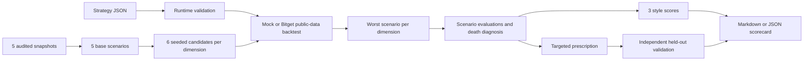

# Strategy Doctor

> 别人造交易策略，我们负责把策略压到极限，说明它为什么失败，并验证修补是否真的更稳。

Strategy Doctor 是 Bitget AI Base Camp Hackathon Track 2 的交易基础设施项目。它读取参数化策略和五维公开市场快照，为每个维度生成一组确定性候选场景，选择伤害最大的场景，完成死因诊断、三风格评分、定向处方和独立 held-out 复测。

- Node.js 24 原生 TypeScript
- 零运行时依赖
- 默认完全离线、确定性、可复现
- 不连接交易账户，不包含任何下单能力
- Bitget 公共 K 线和 Anthropic 叙事均为显式启用的增强功能

## 工作流



| Dimension | 官方 Skill 来源 | 场景 |
|---|---|---|
| `macro` | `macro-analyst` | `grind` / `crash` |
| `market-intel` | `market-intel` | 流动性 `crash` |
| `news` | `news-briefing` | 事件 `gap` |
| `sentiment` | `sentiment-analyst` | 拥挤 `squeeze` |
| `technical` | `technical-analysis` | 假突破 `whipsaw` |

## 快速开始

要求 Node.js 24 或更高版本。

```powershell
npm.cmd ci
npm.cmd run verify
```

`verify` 会运行带门槛的覆盖率测试、TypeScript 检查和离线 demo。当前门槛为 lines 90%、branches 80%、functions 95%。

```powershell
npm.cmd run demo
npm.cmd run demo:json
```

## CLI

```text
node src/cli.ts <strategy.json> [options]

--style conservative|aggressive|trend
--seed <safe-integer>
--candidates <1-50>
--backtest mock|bitget
--format markdown|json
--output <path>
--help
```

示例：

```powershell
node src/cli.ts examples/trend-follower.json --style conservative --seed 42 --candidates 6
node src/cli.ts examples/rsi-bollinger.json --style conservative --seed 42 --candidates 6
node src/cli.ts examples/trend-follower.json --format json --output examples/demo-scorecard.json
```

当前注册并验证了两个互补的策略原型：

| Archetype | 行为 | 专属参数 |
|---|---|---|
| `ma-cross` | 快慢均线交叉的趋势跟随 | `fastMA`、`slowMA` |
| `rsi-bollinger-mean-reversion` | RSI + Bollinger 反转入场，趋势过滤器阻止强趋势中的逆势新仓 | RSI、Bollinger 与趋势过滤参数 |

两种策略共用同一套场景搜索、回测风险循环、评分和 held-out 验证，但由各自
`StrategyAdapter` 负责解析、交易决策与定向处方。非法参数、symbol 或 timeframe
会在回测前被拒绝。

```json
{
  "id": "tf-001",
  "name": "高杠杆趋势跟随",
  "archetype": "ma-cross",
  "params": {
    "fastMA": 8,
    "slowMA": 30,
    "leverage": 10,
    "stopLossPct": 0.5,
    "positionPct": 1
  },
  "universe": ["BTCUSDT"],
  "timeframe": "1h"
}
```

## 离线与在线模式

| 模式 | 命令 | 网络 | 凭证 |
|---|---|---:|---|
| 离线主路径 | `npm.cmd run demo` | 否 | 无 |
| Bitget 公共 K 线 | `npm.cmd run demo:live` | 是 | 无 |
| 刷新五维快照 | `npm.cmd run snapshots:refresh` | 是 | 无 |
| Anthropic 叙事 | 见下方环境变量 | 是 | Anthropic key |

Bitget 模式只调用公开 market-data MCP 的 `crypto_derivatives(action="klines", exchange="bitget")`。K 线按 symbol/timeframe 缓存，场景 shock 以确定性比例叠加到 OHLC，再复用本地回测核心。

刷新快照：

```powershell
npm.cmd run snapshots:refresh
```

命令会在内存中完成五维采集、稳定币聚合、新闻元数据过滤和技术指标计算。只有整套数据通过 parser 后才替换 `examples/*.snapshot.json`。

可选 Anthropic 叙事：

```powershell
$env:DOCTOR_LLM_NARRATE='1'
$env:ANTHROPIC_API_KEY='<your-key>'
$env:DOCTOR_LLM_MODEL='<available-model-id>'
npm.cmd run demo
```

缺少任一配置、超时、非 2xx 或 malformed response 时，系统在 3 秒内回退到本地中文模板。CI 和默认 demo 不调用 Anthropic。

## 输出与搜索规则

每份 Scorecard 包含五维 `evaluations`、三风格评分、deaths 子集、参数处方和 held-out 结果。survivor 也会展示。

```text
damage = (liquidated ? 1000 : 0) + maxDrawdown * 100 - pnl * 100
```

同分候选按场景 ID 排序，保证确定性。held-out 场景针对原始策略选择，既不参与处方搜索，也不受 patched 策略影响。

## 安全边界

- 不实现交易、下单、账户、持仓或资金操作。
- 不需要 Bitget API key、secret 或 passphrase。
- 默认 demo、测试和 CI 均离线运行。
- 新闻快照只保存标题、时间、URL 和风险标签，不保存正文。
- 不人为提高 shock 来保证策略死亡，存活是合法结果。
- 报告明确声明不承诺“一键变好”。

## 项目结构

| 路径 | 职责 |
|---|---|
| `src/data` | 快照读取、MCP client、在线刷新 |
| `src/strategy` | 策略契约、指标、adapter 与注册表 |
| `src/redteam` | 五维映射、候选搜索、死因和叙事 |
| `src/backtest` | Mock 与 Bitget 调度、共享执行引擎 |
| `src/scoring` | 三风格风险评分 |
| `src/prescribe` | 定向修补和 held-out 验证 |
| `src/pipeline` | `runDoctor` 总编排 |
| `src/report` | Markdown 报告 |
| `examples` | 示例策略、冻结快照和 demo 产物 |

更多资料：

- [环境与运行](docs/SETUP.md)
- [3 分钟演示](docs/DEMO.md)
- [提交材料](docs/SUBMISSION.md)
- [Bitget MCP 验证记录](docs/bitget-hub-notes.md)
- [团队协作](docs/TEAM.md)

## 当前限制

- 只支持两个已注册的参考策略，不提供任意策略 DSL 或动态插件。
- 每次只回测一个 symbol；示例使用 `BTCUSDT`。
- Mock 模型不包含手续费、滑点、资金费率和订单簿冲击。
- 处方是参数级风险修补，不是投资建议或收益保证。
- CLI 是本次黑客松的正式界面，不包含 Web UI。

## License

MIT，见 [LICENSE](LICENSE)。
