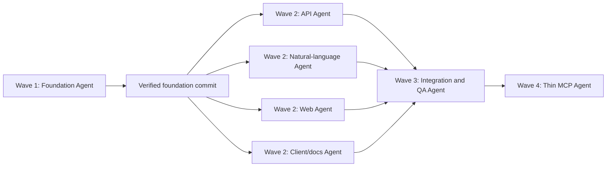

# Strategy Doctor Developer Platform Master Implementation Plan

> **For agentic workers:** REQUIRED SUB-SKILL: Use superpowers:subagent-driven-development (recommended) or superpowers:executing-plans to implement this plan task-by-task. Steps use checkbox (`- [ ]`) syntax for tracking.

**Goal:** Deliver the P1 developer platform through isolated Agent worktrees while preserving the verified P0 CLI and deterministic diagnosis behavior.

**Architecture:** One foundation Agent first freezes shared types, capability metadata, validation, detailed diagnosis output, and package dependencies. Four implementation Agents then work in parallel on disjoint file sets for the API, natural-language parser, Web client, and TypeScript client/docs. A final integration Agent merges them in dependency order, connects the remaining route and static build boundaries, runs browser acceptance, and prepares the public tunnel release.

**Tech Stack:** Node.js 24 native TypeScript, `node:test`, Fastify and official plugins, React, Vite, Apache ECharts, Vitest, Testing Library, Playwright, native `fetch`, Cloudflare Quick Tunnel.

---

## 1. Execution Rule

Do not launch all implementation Agents from commit `150382e`. The API, Web,
natural-language, and client lanes depend on types and package dependencies
that do not exist yet.

Execution uses four waves:



The foundation and integration waves are serial critical-path work. The four
Wave 2 lanes are independent and should run concurrently.

## 2. Branch And Worktree Layout

The current branch `codex/p1-developer-platform-design` contains the approved
specification commit `150382e`.

At execution time, create the integration branch:

```powershell
git switch -c codex/p1-developer-platform
```

Wave 1 works on:

```text
codex/p1-foundation
```

After Wave 1 is reviewed and merged into `codex/p1-developer-platform`, create
all Wave 2 branches from the same verified foundation commit:

```text
codex/p1-api
codex/p1-natural-language
codex/p1-web
codex/p1-client-docs
```

Each branch receives its own Git worktree. No Agent may switch branches inside
another Agent's worktree.

Wave 3 runs only on:

```text
codex/p1-developer-platform
```

Wave 4 runs on:

```text
codex/p1-mcp
```

## 3. File Ownership

| Agent | Exclusive write scope | Forbidden shared files |
|---|---|---|
| Foundation | `AGENTS.md`, `CONTRIBUTING.md`, `package.json`, `package-lock.json`, `tsconfig.json`, `src/contracts.ts`, `src/platform/**`, `src/strategy/**`, `src/prescribe/validate.ts`, `src/pipeline/doctor.ts`, `src/application/**`, `src/cli.ts`, matching tests | `src/server/**`, `src/natural-language/**`, Web components, `src/client/**` |
| API | `src/server/**` except the final parse-route registration, `tests/server/**` | `package*.json`, `src/contracts.ts`, `src/application/**`, `web/**` |
| Natural language | `src/natural-language/**`, `tests/natural-language/**` | `src/server/app.ts`, `package*.json`, `src/contracts.ts`, `web/**` |
| Web | `web/**` | root `package*.json`, `src/server/**`, `src/contracts.ts` |
| Client/docs | `src/client/**`, `tests/client/**`, `examples/agent-client.ts`, draft sections in `docs/API.md` | root `package*.json`, `src/server/**`, `web/**`, `README.md` |
| Integration/QA | `src/server/app.ts`, `src/server/routes/parse.ts`, root scripts if correction is required, `tests/e2e/**`, `.github/workflows/ci.yml`, `README.md`, `docs/SETUP.md`, `docs/DEMO.md`, `docs/SUBMISSION.md`, `handoff.md` | Must not rewrite completed lane modules without review |
| MCP | `src/mcp/**`, `tests/mcp/**`, MCP documentation section, MCP-only dependency changes | diagnosis internals, Web UI |

Every Agent is told that other worktrees are active. Agents must not revert,
format, or reorganize files outside their ownership.

## 4. Plan Files

Wave 1:

- `docs/superpowers/plans/2026-06-14-developer-platform-foundation-plan.md`

Wave 2:

- `docs/superpowers/plans/2026-06-14-developer-platform-api-plan.md`
- `docs/superpowers/plans/2026-06-14-developer-platform-natural-language-plan.md`
- `docs/superpowers/plans/2026-06-14-developer-platform-web-plan.md`
- `docs/superpowers/plans/2026-06-14-developer-platform-client-plan.md`

Wave 3 and Wave 4:

- `docs/superpowers/plans/2026-06-14-developer-platform-integration-release-plan.md`

Each worker receives the full text of its assigned plan. Workers do not infer
requirements from chat history.

## 5. Merge Order

1. Merge `codex/p1-foundation` into `codex/p1-developer-platform`.
2. Create all Wave 2 branches from that merge commit.
3. Run API, natural-language, Web, and client/docs Agents concurrently.
4. Review each lane for specification compliance and code quality.
5. Merge API.
6. Merge natural language.
7. Merge TypeScript client/docs.
8. Merge Web.
9. Integration Agent registers the parse route, resolves only genuine boundary
   conflicts, and runs full verification.
10. Complete browser acceptance, tunnel documentation, README, and handoff.
11. Merge P1 to `main` only after required review and CI.
12. Create the MCP branch from the merged P1 contract and implement P1.1.

The Wave 2 merge order is chosen to make backend contracts available before
the final Web build. It does not imply that those Agents run sequentially.

## 6. Verification Gates

Every lane runs:

```powershell
git diff --check
npm.cmd run typecheck
```

Foundation additionally runs:

```powershell
node --test tests/strategy/*.test.ts tests/prescribe/*.test.ts tests/pipeline/*.test.ts tests/application/*.test.ts tests/cli.test.ts
npm.cmd run verify
```

API lane runs:

```powershell
node --test tests/server/*.test.ts
```

Natural-language lane runs:

```powershell
node --test tests/natural-language/*.test.ts
```

Web lane runs:

```powershell
npm.cmd run test:web
npm.cmd run build:web
```

Client lane runs:

```powershell
node --test tests/client/*.test.ts
```

Integration runs:

```powershell
npm.cmd ci
npm.cmd run verify
npm.cmd run build:web
npm.cmd run test:e2e
git diff --check
git status --short
```

## 7. Conflict Policy

Expected conflicts are prevented rather than resolved later:

- Only Foundation edits root dependencies and shared TypeScript contracts.
- `src/platform/contracts.ts` is the only transport/DTO source for the API,
  natural-language parser, Web type imports, and TypeScript client.
- Only API edits server plugins and route registration during Wave 2.
- Natural language exports a pure parser and does not register its route.
- Web consumes the frozen API types and capability response; it does not
  hardcode a second parameter metadata table.
- Client/docs does not edit `README.md` until Integration.
- Integration performs the one intentional cross-lane connection:
  `POST /api/v1/strategies/parse`.

If an Agent discovers that it must edit an out-of-scope file, it stops and
reports the required interface change. It does not make the edit silently.

## 8. Completion Criteria

P1 is complete only when:

- the original 155-test baseline remains green and the MA golden JSON is
  byte-identical;
- Web, REST, TypeScript client, and CLI call the same application service;
- API capabilities expose both registered strategy definitions;
- local Chinese and English descriptions map only to MA or RSI/Bollinger;
- unsupported or ambiguous descriptions return stable errors;
- the browser requires the shared access code and API clients use Bearer keys;
- the result page renders line, radar, timeline, and parameter-change views;
- browser history is local-only and limited to ten records;
- OpenAPI and quick-start documentation reach a diagnosis without source
  reading or an AI key;
- Cloudflare Quick Tunnel exposes the single local server without exposing
  private trading credentials or account operations;
- full unit, integration, browser, type, coverage, and build gates pass.
