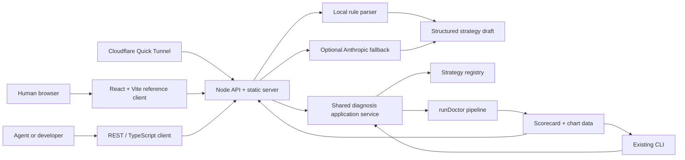

# Strategy Doctor Developer Platform Design

**Status:** Approved in conversation on 2026-06-14; pending written review.

**Milestone:** P1 developer platform.

**Goal:** Turn the existing deterministic two-strategy CLI into a
developer-first diagnostic platform with a REST API, TypeScript client, natural
language reference UI, visual analysis, and a protected temporary public link.

## 1. Product Decision

Strategy Doctor is not positioned as another strategy generator or generic
backtester. It is infrastructure for testing strategies produced by humans or
Agents:

> Trading Agents can generate strategies, but they usually lack deterministic
> adversarial scenarios, explainable failure diagnoses, targeted parameter
> repair, and independent held-out validation. Strategy Doctor supplies that
> missing diagnostic layer.

P1 has two first-class consumers:

1. Developers and Agents submit structured strategy JSON through REST or the
   TypeScript client.
2. Human users describe one of the supported strategies in natural language,
   confirm the parsed parameters, and inspect the result in a React reference
   client.

The Web interface is a reference client built entirely on the same public API.
It must not contain a second implementation of diagnosis, parsing, scoring, or
prescription logic.

## 2. Confirmed Scope

P1 includes:

- Existing `ma-cross` and `rsi-bollinger-mean-reversion` strategies only.
- Local rule-based natural language parsing.
- Optional Anthropic fallback for descriptions that local rules cannot parse
  confidently.
- Mandatory structured parameter confirmation before diagnosis.
- REST API v1 with OpenAPI documentation.
- Small first-party TypeScript client.
- React and Vite reference client.
- ECharts line, radar, timeline, and parameter-change visualizations.
- Shared access-code login for the Web client.
- Bearer keys for Agent and developer API calls.
- In-memory rate and concurrency limits.
- Browser-only diagnosis history through `localStorage`.
- Offline `MockBacktester` only for public Web/API requests in P1.
- One local Node process serving both `/api/v1/*` and built frontend assets.
- Temporary public HTTPS access through Cloudflare Quick Tunnel.

P1 does not include:

- Arbitrary strategy code generation.
- A strategy DSL, dynamic plugins, or a third archetype.
- Bitget private credentials, accounts, orders, balances, or positions.
- Server-side user accounts, databases, or diagnosis history.
- Public Bitget backtesting through the shared public endpoint.
- Permanent cloud deployment or a stable public domain.
- Multi-symbol portfolios.
- Fees, slippage, funding, latency, or order-book execution.
- Monte Carlo, walk-forward, or statistical significance analysis.

These exclusions are explicit so the project remains a reliable developer
tool instead of claiming unsupported strategy or execution semantics.

## 3. Milestone And Collaboration Reset

`AGENTS.md` and `CONTRIBUTING.md` currently freeze the repository at P0 and
explicitly disallow a Web UI. P1 implementation starts by updating those files
before production code changes.

P1 uses short-lived feature branches and ownership by subsystem:

| Lane | Ownership | Primary output |
|---|---|---|
| Platform contract | `src/contracts.ts`, strategy definitions, application service | Stable API-facing model |
| API/security | `src/server/*` | Authenticated REST API and static serving |
| Natural language | `src/natural-language/*` | Rule parser and optional AI fallback |
| Web client | `web/*` | React reference client and charts |
| Developer experience | `src/client/*`, OpenAPI, README | Agent integration path |
| QA/release | integration tests, browser tests, tunnel docs | End-to-end acceptance |

Every phase is independently testable and merged before the next dependent
phase. Existing A/B/C/D P0 branches remain historical implementation lanes and
are not reused for P1 work.

## 4. System Architecture



Development mode uses Vite's `/api` proxy. Shared mode builds the frontend and
starts one Node server on port `8080`. Cloudflare exposes only that port:

```powershell
npm.cmd run web
cloudflared tunnel --url http://localhost:8080
```

The generated `trycloudflare.com` URL is temporary and changes when the tunnel
restarts. It is a team preview mechanism, not a production hosting guarantee.

## 5. Shared Application Service

The current CLI creates scenarios, chooses a backtester, calls `runDoctor`, and
renders the result directly. P1 extracts this orchestration into a reusable
application service.

```ts
interface DiagnoseRequest {
  strategy: Strategy;
  style: StyleName;
  seed: number;
  candidates: number;
}

interface DiagnosisView {
  scorecard: Scorecard;
  summary: {
    riskScore: number;
    worstDrawdownPct: number;
    totalTrades: number;
    robustnessGain: number;
    returnDelta: number;
  };
  charts: {
    treatmentEquity: DimensionEquity[];
    heldOutComparison: DimensionEquityComparison[];
    defaultHeldOutDimension: Dimension;
    riskRadar: DimensionRisk[];
    parameterChanges: ParameterChange[];
    scenarioTimeline: ScenarioTimelineItem[];
  };
}

interface DimensionEquityComparison {
  dimension: ScenarioDimension;
  original: number[];
  patched: number[];
}
```

The application service:

1. Validates the request.
2. Builds treatment and held-out adversarial sets.
3. Uses `MockBacktester` for P1 API requests.
4. Runs diagnosis and prescription once.
5. Preserves the original `Scorecard`.
6. Returns a Web/API view derived from the same metrics.

The CLI calls the same service and continues rendering the original Scorecard.
Existing CLI commands and the MA golden output remain byte-compatible.

### Detailed held-out metrics

`Scorecard` currently contains only held-out summary deltas. The chart needs the
original and patched held-out equity curves. P1 introduces a detailed internal
validation result and preserves the current function:

```ts
interface HeldOutValidation {
  tradeoff: Tradeoff;
  originalMetrics: Metrics[];
  patchedMetrics: Metrics[];
}

validateOnHeldOutDetailed(...): Promise<HeldOutValidation>;
validateOnHeldOut(...): Promise<Tradeoff>;
```

`validateOnHeldOut` delegates to the detailed function and returns
`.tradeoff`, preserving existing callers and tests.

### Chart transformation rules

Chart data is derived deterministically from `Metrics` and `Scorecard`; the
frontend does not recalculate diagnostic meaning.

- Held-out comparison keeps one original/patched pair per scenario dimension.
  The backend exposes `defaultHeldOutDimension` as the dimension with the
  largest original drawdown. The Web client initially displays it and lets the
  user switch dimensions without recalculating diagnostic meaning.
- Radar risk is `100` for a liquidated scenario. Otherwise it is
  `round(clamp(maxDrawdownPct * 100, 0, 100))`.
- Scenario timeline is sorted by existing `damageScore`, highest damage first.
- Parameter changes contain only parameters whose prescribed value differs
  from the submitted value.
- Equity arrays preserve scenario order and point order from the backtester;
  they are never averaged across dimensions.

## 6. Strategy Capability Model

External Agents must be able to discover supported strategies without reading
source code. Each adapter gains one machine-readable definition:

```ts
interface ParameterDefinition {
  key: StrategyParamKey;
  label: string;
  description: string;
  kind: 'integer' | 'number';
  minimum: number;
  maximum?: number;
  exclusiveMinimum?: boolean;
  defaultValue: number;
}

interface StrategyDefinition<A extends StrategyArchetype> {
  archetype: A;
  displayName: string;
  description: string;
  parameters: readonly ParameterDefinition[];
  example: StrategyByArchetype<A>;
}
```

The registry exposes:

```ts
listDefinitions(): readonly StrategyDefinition<StrategyArchetype>[];
getDefinition(archetype): StrategyDefinition<typeof archetype>;
```

Definitions drive:

- `GET /api/v1/capabilities`
- Web confirmation forms
- Local natural language defaults
- TypeScript client types and examples
- OpenAPI examples
- Parameter help and validation messages

There must not be separate parameter metadata tables in the API, frontend, and
natural language parser.

## 7. Compatibility Corrections

### Single symbol

`StrategyBase.universe` remains an array for P0 compatibility, but P1 runtime
validation requires exactly one symbol:

```ts
strategy.universe.length === 1
```

The API and documentation call this a single-symbol diagnostic. Multi-symbol
input returns `MULTI_SYMBOL_UNSUPPORTED` instead of silently using index zero.

### Return naming

The legacy `Scorecard.tradeoff.returnCost` remains unchanged so the CLI golden
artifact does not break. API v1 and `DiagnosisView.summary` expose the same
value as `returnDelta`.

The API documentation defines:

- positive `returnDelta`: patched mean return increased;
- negative `returnDelta`: patched mean return decreased.

### Symbol and timeframe validation

P1 supports:

- symbols ending in `USDT`, normalized to uppercase;
- timeframes `1h`, `4h`, and `1d`.

Unsupported values fail before scenario generation with a field-level error.
This is a product boundary, not a claim that every exchange supports every
possible market string.

## 8. Natural Language Parsing

### Local parser first

The local parser is deterministic and supports Chinese and English keywords
for the two registered strategies.

It extracts:

- archetype;
- symbol;
- timeframe;
- leverage;
- stop loss;
- position size;
- strategy-specific signal parameters.

It returns a draft, not an executable diagnosis:

```ts
interface StrategyDraft {
  strategy: Strategy;
  source: 'rules' | 'anthropic';
  confidence: number;
  assumptions: DraftAssumption[];
  warnings: DraftWarning[];
}
```

Every field records whether it came from explicit text or a registered default.
Defaulted fields appear as assumptions in the confirmation screen.

### Supported recognition

MA recognition requires MA, moving-average, 均线, crossover, 交叉, trend
following, or 趋势跟随 terminology.

RSI/Bollinger recognition requires RSI or relative-strength terminology plus
Bollinger, 布林, mean reversion, 均值回归, overbought, or oversold terminology.

If both archetypes are requested, neither is recognizable, or the description
requests custom executable logic, the parser returns a structured unsupported
or ambiguous error.

### Optional Anthropic fallback

Anthropic is called only when:

- local parsing confidence is below the acceptance threshold;
- `DOCTOR_NL_AI_ENABLED=1`;
- API key and model are configured.

The model receives the two capability definitions and must return JSON for one
registered archetype. The response is passed through `parseStrategy`; invalid
or unsupported output is rejected. AI never generates or executes source code.

Any timeout, HTTP failure, malformed JSON, or unsupported archetype falls back
to the local parser result and its warnings. Core Web/API use remains available
without an AI key.

### Confirmation boundary

Parsing and diagnosis are separate endpoints. The server never automatically
runs a parsed draft. The user or Agent submits the final structured strategy to
the diagnosis endpoint.

## 9. REST API v1

### Endpoints

```text
GET    /api/v1/health
POST   /api/v1/auth
DELETE /api/v1/auth
GET    /api/v1/capabilities
POST   /api/v1/strategies/parse
POST   /api/v1/diagnoses
GET    /api/v1/openapi.json
```

`health` is public and returns no environment or secret details. All other
endpoints require either a valid Web session cookie or Bearer API key.

### Diagnosis request

```json
{
  "strategy": {
    "id": "rsi-web-001",
    "name": "RSI Bollinger strategy",
    "archetype": "rsi-bollinger-mean-reversion",
    "params": {
      "rsiPeriod": 10,
      "rsiOversold": 30,
      "rsiOverbought": 70,
      "bollingerPeriod": 14,
      "bollingerStdDev": 1.75,
      "trendFilterPeriod": 30,
      "trendFilterThreshold": 0.05,
      "leverage": 3,
      "stopLossPct": 0.05,
      "positionPct": 0.5
    },
    "universe": ["BTCUSDT"],
    "timeframe": "4h"
  },
  "style": "conservative",
  "seed": 42,
  "candidates": 6
}
```

The response contains `DiagnosisView` plus:

```ts
interface ApiEnvelope<T> {
  apiVersion: 'v1';
  requestId: string;
  data: T;
}
```

### Error contract

```json
{
  "apiVersion": "v1",
  "requestId": "req_...",
  "error": {
    "code": "UNSUPPORTED_ARCHETYPE",
    "message": "Only ma-cross and rsi-bollinger-mean-reversion are supported.",
    "field": "strategy.archetype",
    "retryable": false
  }
}
```

Required stable error codes include:

- `AUTH_REQUIRED`
- `AUTH_INVALID`
- `RATE_LIMITED`
- `SERVER_BUSY`
- `INVALID_REQUEST`
- `AMBIGUOUS_DESCRIPTION`
- `UNSUPPORTED_STRATEGY_DESCRIPTION`
- `UNSUPPORTED_ARCHETYPE`
- `MULTI_SYMBOL_UNSUPPORTED`
- `UNSUPPORTED_SYMBOL`
- `UNSUPPORTED_TIMEFRAME`
- `DIAGNOSIS_FAILED`

Internal stack traces, environment values, API keys, and raw AI responses are
never returned.

## 10. API Server And Security

P1 uses Fastify as the Node API framework because the product requires schema
validation, cookies, static assets, rate limits, and OpenAPI. This is a scoped
exception to P0's zero-runtime-dependency rule and must be recorded in the
P1 collaboration documents.

Core Fastify provides route JSON Schema validation, response serialization,
body limits, proxy configuration, and `inject`-based tests. P1 uses the matching
official plugins for cookies, static assets, OpenAPI, and rate limiting. Plugin
versions must be compatible with the selected Fastify major version.

### Authentication

Web users:

1. Submit `DOCTOR_WEB_ACCESS_CODE` to `/auth`.
2. The server performs a timing-safe comparison.
3. The server returns a signed HttpOnly session cookie.
4. The cookie uses `SameSite=Lax`; it is `Secure` when the original forwarded
   protocol is HTTPS.
5. The session expires after 12 hours.

Agent users send:

```text
Authorization: Bearer <DOCTOR_API_KEY>
```

The server accepts a comma-separated set of keys from `DOCTOR_API_KEYS`.
Secrets are provided only through environment variables and never committed.

### Request protection

- JSON content type is required for mutation endpoints.
- Request body maximum: 32 KiB.
- Natural language description maximum: 2,000 characters.
- Authentication attempts: 5 per IP per 15 minutes.
- Parse requests: 20 per IP per minute.
- Diagnosis requests: 6 per IP per minute.
- Maximum active diagnoses: 2 per process.
- Excess concurrent requests return `SERVER_BUSY`.
- Cross-origin mutation requests are rejected.
- Forwarded client IP is trusted only from the local Cloudflare connector.
- Server logs include request ID, route, status, and duration, but not strategy
  text, secrets, or complete reports.

The Web service refuses non-loopback binding unless access code and session
secret are configured.

## 11. React Reference Client

### Technology

- React with TypeScript.
- Vite for development and production build.
- Apache ECharts with modular imports.
- Browser `localStorage` for recent diagnoses.
- No server database.

The current Node 24 requirement satisfies current Vite runtime requirements.
Vite proxies `/api` to the local API during development. Production assets are
served by the Fastify process.

### Interaction flow

1. Access-code screen.
2. Natural language description.
3. Parsed strategy confirmation.
4. Manual field correction if needed.
5. Explicit "Confirm and diagnose" action.
6. Visual diagnosis workspace.

The confirmed dark financial-analysis direction uses:

- left rail for description and structured confirmation;
- summary risk cards;
- original versus patched held-out equity line chart;
- five-dimension risk radar;
- five-dimension scenario timeline;
- parameter before/after visualization;
- expandable detailed evaluation table;
- JSON and Markdown export;
- developer integration panel.

### Developer panel

Every result page provides:

- confirmed Strategy JSON;
- equivalent `curl` request;
- equivalent TypeScript client example;
- link to OpenAPI JSON;
- request ID for debugging.

This proves that the Web interface is not a closed demo and that another Agent
can call the same capability directly.

### Responsive behavior

- Desktop: confirmation rail and results workspace side by side.
- Tablet: confirmation above results with two-column charts.
- Mobile: one-column flow; charts have fixed minimum height and horizontal
  labels collapse into tooltips.

ECharts instances register resize observers and are disposed when components
unmount.

### Browser history

The browser stores at most 10 records:

```ts
interface StoredDiagnosis {
  id: string;
  createdAt: string;
  description: string;
  requestId: string;
  request: DiagnoseRequest;
  view: DiagnosisView;
}
```

Users can reopen, export, or delete records. The server does not receive a
history-sync request. If browser storage quota is exceeded, the client removes
the oldest records and retries once; if the retry fails, the current diagnosis
remains usable and the UI displays a non-blocking history warning.

## 12. TypeScript Client

The first-party client is intentionally small:

```ts
const doctor = createStrategyDoctor({
  baseUrl: 'https://example.trycloudflare.com',
  apiKey: process.env.STRATEGY_DOCTOR_API_KEY!,
});

const capabilities = await doctor.capabilities();
const draft = await doctor.parseStrategy({
  description: 'BTC 4h RSI and Bollinger mean reversion...',
});
const result = await doctor.diagnose({
  strategy: draft.strategy,
  style: 'conservative',
  seed: 42,
  candidates: 6,
});
```

The client:

- uses native `fetch`;
- sends Bearer authentication;
- parses the common API envelope;
- throws a typed `StrategyDoctorApiError`;
- has no React or Node-server dependency;
- is exercised against the real local API in integration tests.

P1 keeps the client inside the repository. Publishing it as a separate npm
package is a later release decision.

## 13. OpenAPI And Developer Documentation

`GET /api/v1/openapi.json` documents:

- all endpoints;
- authentication modes;
- strategy schemas;
- field bounds and examples;
- stable errors;
- DiagnosisView chart data;
- deterministic seed behavior;
- offline-only P1 limitation.

README provides four five-minute paths:

1. Web user.
2. REST/curl developer.
3. TypeScript developer.
4. Existing CLI user.

The developer path must reach a diagnosis with no source-code reading and no
AI key.

## 14. Testing Strategy

### Existing compatibility

- All current 155 tests continue passing.
- MA golden JSON remains byte-identical.
- Existing CLI commands remain unchanged.
- Default test and CI paths remain offline.

### Unit tests

- strategy definitions and registry metadata;
- exact single-symbol validation;
- timeframe and symbol normalization;
- detailed held-out validation;
- chart-data transformations;
- local Chinese and English parsing;
- ambiguous and unsupported descriptions;
- AI fallback validation and deterministic failure fallback;
- auth token signing and expiry;
- rate and concurrency limits;
- TypeScript client envelope and error handling.

### API integration tests

- public health;
- access-code login and logout;
- Cookie and Bearer authentication;
- capability discovery;
- parse without AI key;
- confirmed diagnosis;
- uniform error envelopes;
- request size, rate, and concurrency rejection;
- no server-side persistence.

### Frontend tests

- login;
- description input;
- assumptions and warnings;
- parameter confirmation;
- diagnosis loading and failure states;
- all four visualization families;
- local history create, reopen, export, and delete;
- developer panel examples.

### Browser acceptance

A real browser test runs:

1. Login.
2. Enter an RSI/Bollinger Chinese description.
3. Confirm parsed parameters.
4. Run diagnosis.
5. Verify five evaluations, one actionable death, non-empty prescription, and
   visible charts.
6. Reload and reopen the result from browser history.

The same acceptance is repeated for MA with a shorter path.

## 15. Delivery Phases

### Phase 0: Governance and compatibility

- Close P0 in `AGENTS.md` and `CONTRIBUTING.md`.
- Establish P1 ownership and branch rules.
- Enforce exactly one symbol.
- Add supported timeframe and symbol validation.
- Document `returnCost` as legacy and expose `returnDelta` in API views.

### Phase 1: Shared diagnosis service

- Extract CLI orchestration into an application service.
- Add detailed held-out metrics.
- Add DiagnosisView and chart transformations.
- Migrate CLI to the shared service without output changes.

### Phase 2: Developer API

- Add Fastify server.
- Add capabilities, diagnosis, health, and OpenAPI endpoints.
- Add access-code Cookie and Bearer authentication.
- Add body, rate, concurrency, origin, and logging protections.
- Serve built frontend assets.

### Phase 3: Natural language

- Add deterministic Chinese and English rule parser.
- Add assumptions, warnings, confidence, and unsupported errors.
- Add optional Anthropic fallback constrained by capability definitions.

### Phase 4: React visual workspace

- Add access-code screen.
- Add description and parameter-confirmation workflow.
- Add summary, line, radar, timeline, and parameter-change charts.
- Add details, export, local history, and developer panel.

### Phase 5: Developer experience

- Add first-party TypeScript client.
- Finalize OpenAPI examples.
- Add REST, client, Web, and CLI quick starts.
- Add Agent integration demo.

### Phase 6: Team sharing and release

- Add `npm.cmd run web`, development, and build scripts.
- Add Cloudflare Quick Tunnel instructions and secret setup.
- Add end-to-end browser acceptance.
- Update demo and submission material around developer integration.

Each phase requires its own tests, verification, commit, PR, and handoff.

## 16. Remaining Defect Roadmap

P1 resolves:

- CLI-only usability;
- lack of natural language entry;
- lack of visual analysis;
- lack of Agent-facing API;
- lack of capability discovery;
- single-symbol contract ambiguity;
- unsupported symbol/timeframe ambiguity;
- `returnCost` naming ambiguity at the API boundary;
- absence of shared access controls for public preview;
- duplicated future orchestration risk between CLI and Web.

P1.1 Agent-native integration, immediately after the P1 contract stabilizes:

1. Thin stdio MCP server using the public REST contract.
2. Tools for capability discovery, description parsing, and diagnosis.
3. MCP smoke test against the same local API used by the TypeScript client.

P2 backtest realism should follow P1:

1. Fees and configurable slippage.
2. Funding-rate costs.
3. OHLC-aware stop and liquidation execution.
4. Execution latency and configurable fill policy.
5. Honest separation between synthetic Mock and public-data evidence.

P3 research validity:

1. Walk-forward validation.
2. Monte Carlo path perturbation.
3. Confidence intervals and statistical significance.
4. Longer historical windows.
5. Multi-timeframe validation.

P4 breadth:

1. Portfolio and multi-symbol contracts.
2. Third registered strategy.
3. Versioned adapter SDK.
4. Permanent hosted deployment if usage justifies it.

The sequence is intentional: developer access and product usability come first
for the Track 2 product requirement; execution realism comes before broad
strategy claims. MCP follows the stable P1 REST contract, while broader plugin
and strategy breadth waits for versioned adapter contracts.

## 17. Acceptance Criteria

P1 is complete when:

- A new developer reaches a diagnosis within five minutes of cloning.
- An external Agent integration requires no more than 15 lines of TypeScript.
- Web, REST, TypeScript client, and CLI use the same diagnosis service.
- No AI key is required for either supported strategy.
- AI output cannot bypass parser validation or parameter confirmation.
- Same strategy, snapshots, seed, and candidates produce identical results.
- The Web result displays line, radar, timeline, and parameter-change charts.
- Browser history persists locally and the server stores no user strategies.
- Public preview requires an access code and enforces rate and concurrency
  limits.
- API responses use stable envelopes and machine-readable errors.
- Capabilities and OpenAPI expose strategy bounds and examples.
- Existing CLI behavior, MA golden output, and coverage gates remain intact.
- README demonstrates human and Agent integration paths.

## 18. Success Metrics

The release records:

- time from clone to first CLI diagnosis;
- time from clone to first Web diagnosis;
- lines in the TypeScript Agent example;
- API parse and diagnosis latency on the reference machine;
- frontend production bundle size;
- browser accessibility audit results;
- full test counts and coverage;
- number of optional versus required environment variables.

These metrics demonstrate low adoption cost instead of relying only on feature
claims.
